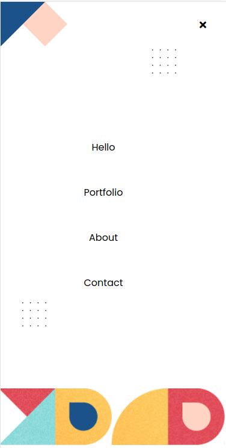

# MYPORTFOLIO MOBILE MENU

`This project is the fiveth  milestone in myportfolio website. Here i created a branch to continue working on my portfolio but the mobile menu.The goal was to combine all the tools and best practices I just learned into a repo: Github Workflows, Linters, Flexbox, Grid system, Documenting my repo professionally With a perfect README.`

Additional description about the project and its features.

## Built With

- Html
- Css
- Linters
- Markdown

### LIVE LINK
 click here to view this project [Live link](https://gabrielcoder247.github.io/)

## Getting Started
### Instructions on how to run my project locally on your machine
1. Go  to my git repository [myportfolio](https://github.com/gabrielcoder247/myportfolio-2/tree/milestone-2)
2. then click on download zip folder
3. open the folder on your local machine via code editor
4. if you want to run the project, open it via the browser

👤 **Authors**

**GABRIEL NWACHUKWU**

- GitHub: [@githubhandle](https://github.com/gabrielcoder247)
- LinkedIn: [LinkedIn](https://www.linkedin.com/in/gabriel-nwachukwu-209613173/)

**DEBAS GEBRESLASIE**
- GitHub: [@githubhandle](https://github.com/Debas-31)

## 🤝 Contributing

Contributions, issues, and feature requests are welcome!

## Show your support

Give a ⭐️ if you like this project!

## 📝 License

This project is [MIT](./MIT.md) licensed.
