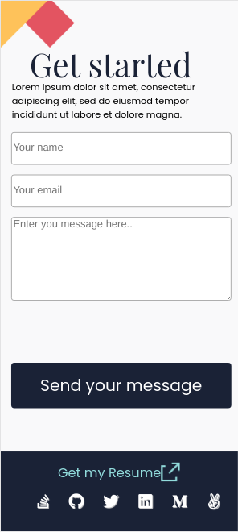

# MYPORTFOLIO MOBILE VERSION CONTACT FORM

`This project is the third milestone in myportfolio website mobile version. Here i and  **AZARIA SAIDI ALLY**
GitHub: [@azy64](https://github.com/azy64) worked on it. I created a new branch called "milestone-3 and he created form-style and form-style-2 branches", then i built the html structures for the third milestone, my contact form,  footer and socail icons and he styled my contact forms and the footer and the social icons, so we built myporfolio mobile version contact form aas collaborators. The goal was to combine all the tools and best practices I just learned into a repo: Github Workflows, Linters, Flexbox, Grid system, Documenting my repo professionally With a perfect README.`

Additional description about the project and its features.

## Built With

- Html
- Css
- Linters
- Markdown

## Getting Started
### Instructions on how to run my project locally on your machine
1. Go  to my git repository [myportfolio](https://github.com/gabrielcoder247/myportfolio-2/tree/milestone-2)
2. then click on download zip folder
3. open the folder on your local machine via code editor
4. if you want to run the project, open it via the browser

👤 **Authors**

**GABRIEL NWACHUKWU**

- GitHub: [@githubhandle](https://github.com/gabrielcoder247)
- LinkedIn: [LinkedIn](https://www.linkedin.com/in/gabriel-nwachukwu-209613173/)

 **AZARIA SAIDI ALLY**
- GitHub: [@azy64](https://github.com/azy64)
- LinkedIn: [LinkedIn](https://www.linkedin.com/in/azaria-saidi-524780112/)

## 🤝 Contributing

Contributions, issues, and feature requests are welcome!

## Show your support

Give a ⭐️ if you like this project!

## 📝 License

This project is [MIT](./MIT.md) licensed.
